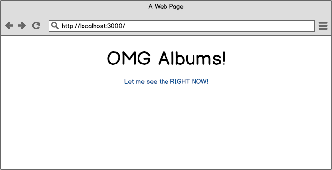
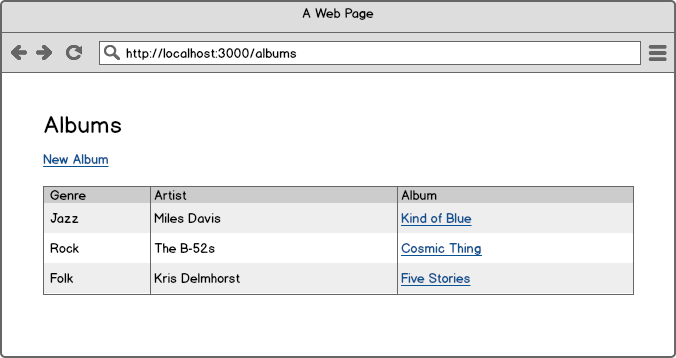
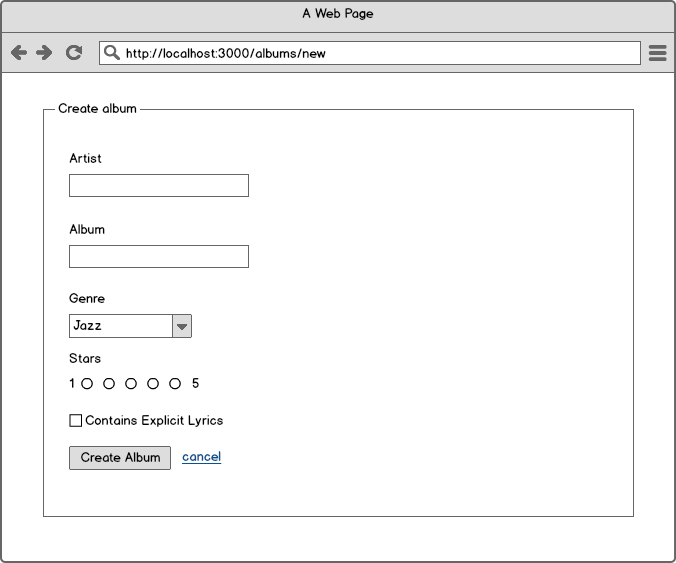
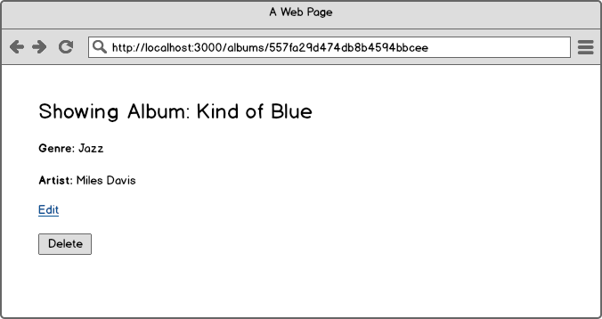
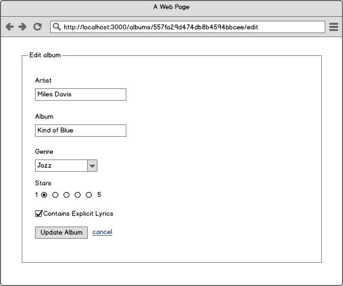

# CRUD with Express/PostgreSQL/Knex

## Setup

Generate a new Express app, `cd` into it, then:

```
npm install
nodemon
```

## Instructions

### Create the index page

Add the heading the and the link to `/albums`

**Create albums index**

Create a new routes file for albums:

```
touch routes/albums.js
```

Wire up the routes file in `app.js`

```js
var albums = require('./routes/albums');
app.use('/', albums);
```

Write the albums index route:

```js
var express = require('express');
var router = express.Router();

router.get('/albums', function(req, res, next) {
  res.render('albums/index');
});

module.exports = router;
```

Create the albums template:

```
mkdir views/albums
touch views/albums/index.jade
```

Populate the albums index:

```
extends ../layout

block content
  h1 Albums

  a(href="/albums/new") New Album
```

### Create the "new" page

Create the `/albums/new` route:

```js
router.get('/albums/new', function(req, res, next) {
  res.render('albums/new');
});
```

Create the `/albums/new.jade` template:

```
extends ../layout

block content
  h1 New Album

  form(action="/albums", method="post")
    div
      Name
      input(type="text" name="album_name")

    div
      input(type="submit")
```

### Create the "create" route

Create the `/albums` route:

```js
router.post('/albums', function(req, res, next) {
  res.redirect('/albums');
});
```

Now you have the basic flow setup, it's time to add Postgres.

### Adding PostgreSQL to create

We'll talk to Postgres using Knex: http://knexjs.org/

First create the database:

```
createdb album-demo
```

Then install and configure knex:

```
npm install --save pg knex
npm install knex -g
knex init
```

Update `knexfile.js` with the following:

```js
module.exports = {

  development: {
    client: 'postgresql',
    connection: 'postgres://localhost/album-demo'
  },

  production: {
    client: 'postgresql',
    connection: process.env.DATABASE_URL
  }

};
```

Create a migration for the `albums` table:

```
knex migrate:make create_albums
```

In the `migrations` directory there is now a single file.  Change it to:

```js
exports.up = function(knex, Promise) {
  return knex.schema.createTable('albums', function (table) {
    table.increments();
    table.string('artist');
    table.string('name');
    table.string('genre');
    table.integer('stars');
    table.boolean('explicit');
  });
};

exports.down = function(knex, Promise) {
  return knex.schema.dropTable('albums');
};
```

Run migrations with:

```
knex migrate:latest
```

Establish a connection to the database by creating a file named `db/knex.js` with the following:

```js
var environment = process.env.NODE_ENV || 'development';
var config = require('../knexfile.js')[environment];
module.exports = require('knex')(config);
```

In `routes/albums.js` establish a connection to the database:

```js
var knex = require('../db/knex');
function Albums() {
  return knex('albums');
}
```

Then in your create route, insert the data:

```js
router.post('/albums', function(req, res, next) {
  Albums().insert({ name: req.body.album_name }).then(function () {
    res.redirect('/albums');
  });
});
```

Now when you run your code you'll be inserting data into the database. Begin by running the server using `nodemon`. Next, open the browser and navigate to http://localhost:3000/albums. Next, click on "New Album", fill in the form and click "Submit." To check that the data was inserted into the database, run:

```
psql album-demo
```

From within psql, run:

```
select * from albums;
```

You should see the album you inserted.


### Insert the rest of the data

Notice how in the wireframes below (and in the migration) there are more fields in albums?

Write the code to both insert and display all the fields.

---

### STOP - Create a sequence diagram

Go to https://www.websequencediagrams.com/

Describe what's happening.  Start with:

```
participant Browser
participant Express
participant PostgreSQL

# put your code here
```

Embed your image here.

---

### Showing all albums on the index page

Update the index route to pull all records from the database:

```js
router.get('/albums', function(req, res, next) {
  Albums().select().then(function (records) {
    res.render('albums/index', {allAlbums: records});
  });
});
```

Add the following table to the `block content` section of `views/albums/index.jade`

```
  table
    thead
      tr
        th ID
        th Name
    tbody
      for album in allAlbums
        tr
          td= album.id
          td= album.name
```

### Create the show page

Add a link to the show page:

```
  table
    thead
      tr
        th ID
        th Name
    tbody
      for album in allAlbums
        tr
          td= album.id
          td
            a(href='/albums/' + album.id)= album.name
```

Add the show page route:

```js
router.get('/albums/:id', function(req, res, next) {
  Albums().where({id: req.params.id}).first().then(function (record) {
    res.render('albums/show', {theAlbum: record});
  });
});
```

Create the show page:

```
touch views/albums/show.jade
```

```
extends ../layout

block content
  h1= theAlbum.name

  a(href="/albums/" + theAlbum.id + '/edit') Edit
```

### Your turn!! - Edit / Update

OK - now you have everything you need in order to create your edit/update view.  Here's what you have to do:

- Create an edit route
- Create a form (see the edit wireframe below) that has the fields from the album pre-populated
- The form should post to `/albums/:id/update`
- The update route should update that record, and redirect to the show page

You can put _almost_ all of this together yourself:

- You can see how to define dynamic routes from the show route
- You can see how to find the individual record from the show route
- You know how to update a record in `psql`, and you have a link to [Knex](http://knexjs.org/#Builder-update) so you can figure out how to make the update
- You know how to redirect from the create route

The hardest part will be getting the select field to be preselected.  [This answer](http://stackoverflow.com/a/10368381/4229462) should help with that.

---

### BUT STOP - Create a sequence diagram _first_

Draw a sequence diagram of what the update action will be.  Include the redirect to the show page.

```
participant Browser
participant Express
participant PostreSQL

# put your code here
```

Paste your image here.

---


### And finally, delete

Delete's a little tricky.  You need to add a form to the show page that will post to `/albums/:id/delete`.

Then add your delete route that will delete the record from the table, and also redirect to the index page.

# Wireframes

Pay attention to the URLs.










